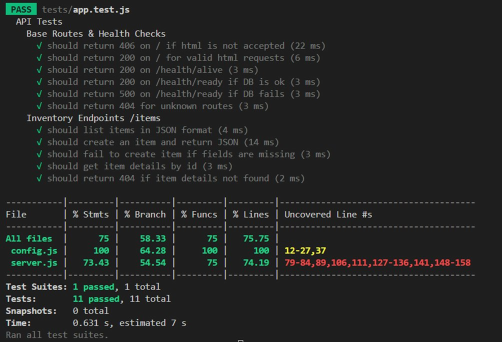
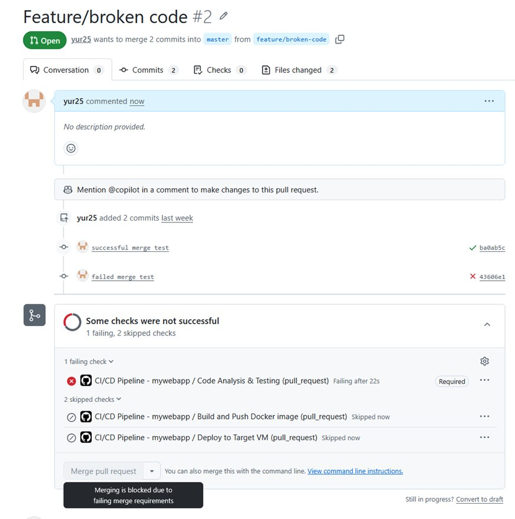
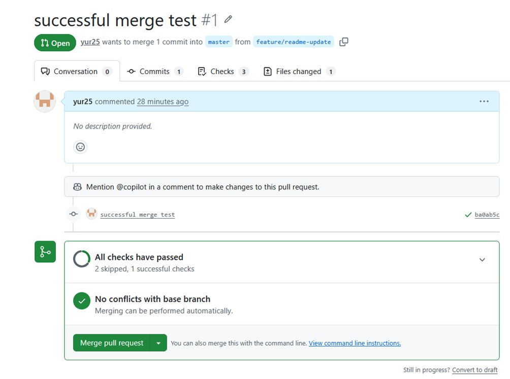
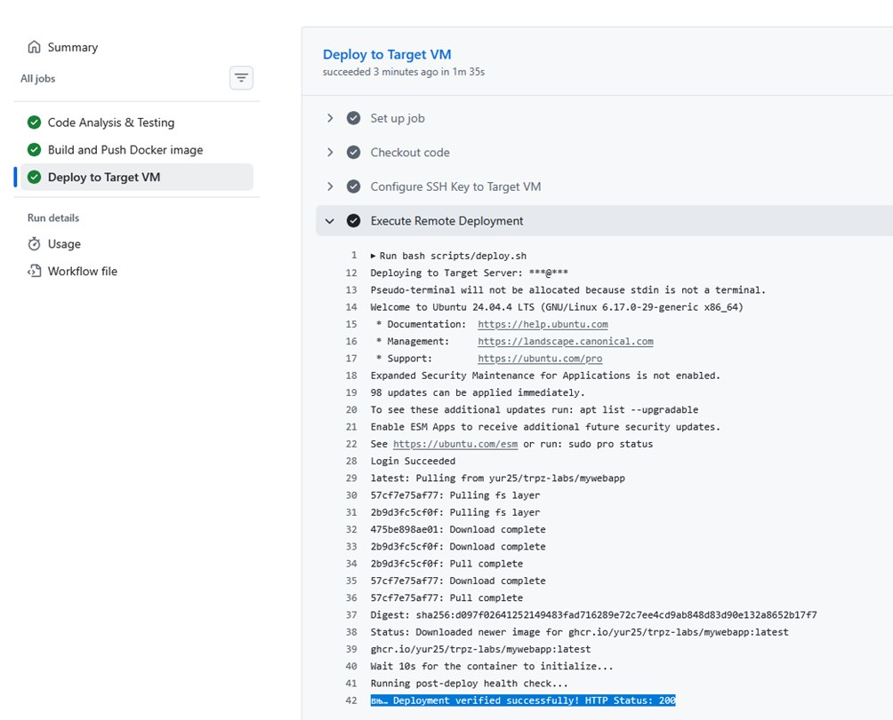
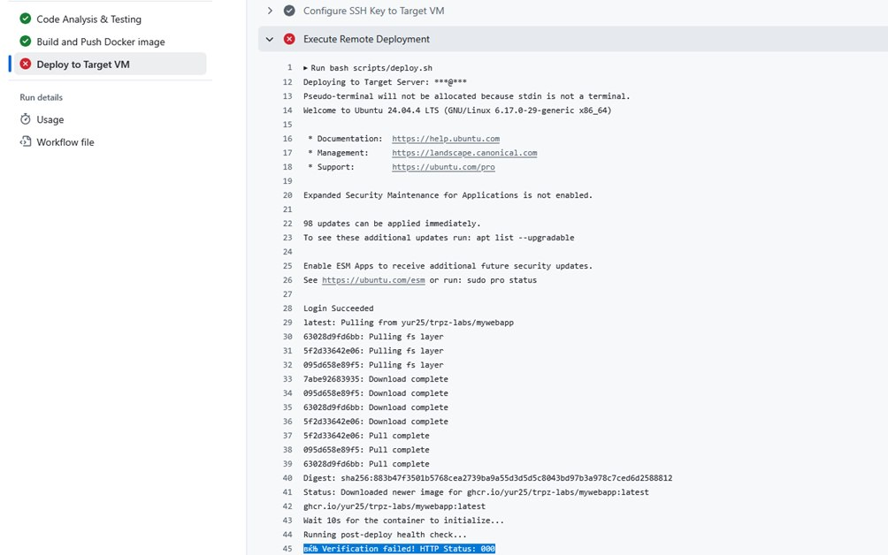

## Lab 3: Continuous Integration & Continuous Deployment (CI/CD)

This project uses **GitHub Actions** to enforce code quality and automate code deployment.

- **CI Pipeline:** On every push or PR to `main`, the code is verified through `.yamllint`, `ESLint`, `shellcheck`, and `hadolint`. A `Jest` test suite runs unit/integration tests with an enforced >40% test coverage threshold.
- **Docker Image Publishing:** Once tests pass on `main`, the image is built and stored in GitHub Container Registry (GHCR). Automatically tagged with `latest` and `sha-<commit>`.
- **CD Pipeline:** Pushing an annotated tag (e.g., `git tag -a v1.0.0 -m "Release" && git push --tags`) triggers the deployment logic on a **self-hosted runner**. It connects via SSH to the Target Server to pull the image and assign a `stable` tag. 
- **Self-Hosted Runner & Systemd:** A distinct Ubuntu VM acts as the runner. The application lifecycle on the target server is centrally managed via a persistent `systemd` daemon `mywebapp-docker.service`.

## Proof of Execution (Screenshots)

### 1. Code Coverage Results
*Screenshot showing the test coverage results meeting the >40% threshold requirements.*

### 2. Branch Protection & Status Checks
*Demonstration of branch protection blocking merges until CI passes:*

*Demonstration of a successful Pull Request passing all required status checks:*

### 3. Successful Deployment (Scenario B)
*The pipeline successfully deploying the container to the Target VM and returning an HTTP 200 health check.*

### 4. Failed Deployment Check (Scenario D)
*The pipeline correctly detecting a failure when the health check endpoints are unavailable (e.g. returning HTTP 000/500/etc.).*

